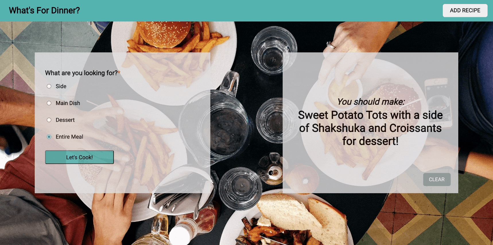

# What's For Dinner?

## Overview
What's for dinner? Ah yes, the age old question. If you've ever been one to argue with your partner or friend over choosing what to make for dinner, you've come to the right place.  What's For Dinner is an application that takes the headache out of choosing your next meal.

## Functionality
-   When you visit [What's For Dinner](https://rachaelcarroll.github.io/whats-for-dinner/) you will see two boxes on the screen. On the left you can select a side, main, dessert, or entire meal option and click **Let's Cook!**  
   
-   A random side, main, dessert, or entire meal suggestion will appear on the right side of the screen.  

### Future Additions
Future additions to this application will include:

- Clear button functionality: User can select *Clear* and the suggested recipe will be hidden
- Add a Recipe: The ability to add a new recipe to the desired category
- Favorite Recipes: Allow users to click a favorite button and view all favorite recipes
- User Login: User will land on a login page upon opening the app
- Adaptable screen size: App will fit mobile, tablet, desktop and extra large screens

### Contributor
The HTML, CSS, and Javascript for What's For Dinner was written by [Rachael Carroll](https://github.com/rachaelcarroll), a frontend engineering student at [Turing School of Software & Design](https://turing.io/).

### Languages
* HTML
* CSS
* JavaScript

### Technical Goals
* Writing semantic HTML
* Wireframing
* Implementing foundational CSS
* Utilizing event listeners to respond to user events
* Writing and refactoring clean JavaScript

### Online Resources
* Git and Github: Project management and workflow
* MDN docs & Stack Overflow: Online resources
